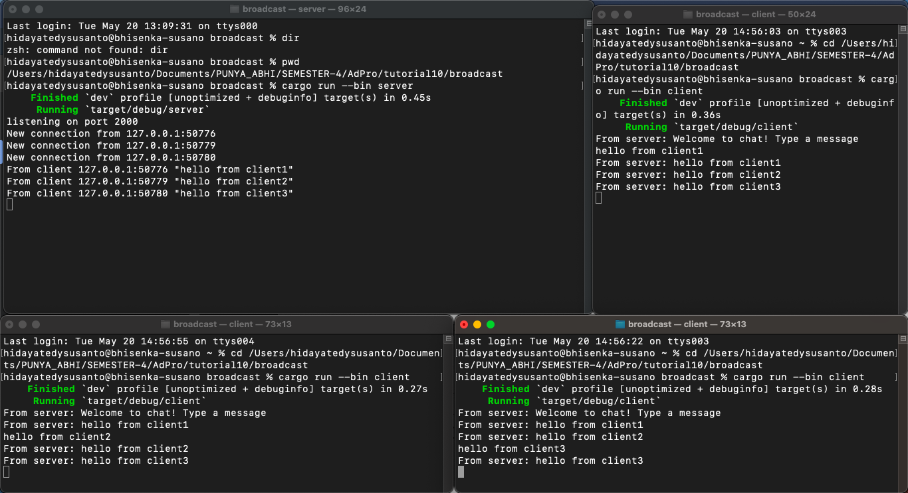
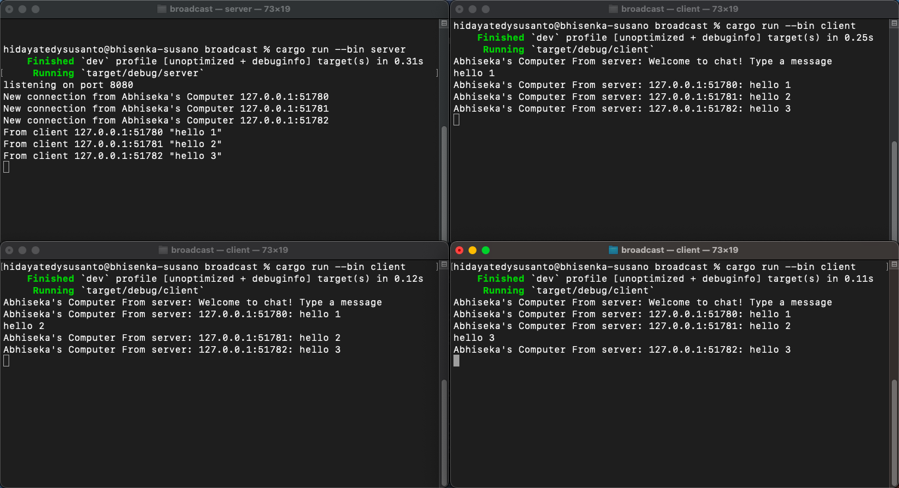

# Module 10 Reflection

## Abhiseka Susanto - 2306244942, Class A

### 2.1. Original code, and how it run

In the image, the top-left terminal represents the server, while the others are clients. To run the server, use the command cargo run --bin server. To run the client, use the command cargo run --bin client. 

When a client is started, the server detects a new connection from that client—and the same happens for other connected clients. When I type a message in one of the clients, that message is sent to the server, which then broadcasts it to all connected clients, including the sender. That’s why even if only one client sends a message, all clients receive it.

### 2.2. Modifying the websocket port

After changing the port, the chat broadcast still works as usual. The difference is that we now explicitly instruct the server to listen on port 8080. To ensure the broadcast continues to function, both WebSocket connections—on the client and server sides—must operate on the same port. If they use different ports, the two sides won’t be able to communicate or establish a connection.

In this case, since we have both `client.rs` and `server.rs`, we need to update the port settings in both files where the WebSocket connections are defined. Both WebSocket implementations appear to be using the same protocol, which is TCP.

### 2.3. Small changes, add IP and Port

First, on the server side, I modified the part that prints `"New connection from..."` by adding my name there. I changed that section specifically because it prints a string directly. Then, I updated the `handle_connection` function—particularly the part that sends messages using `bcast_tx`. In that section, I changed the message to a formatted string that includes the sender’s address. This way, the string received by the clients includes the IP address of the client that sent the message.

On the client side, I only modified the `"From server: ..."` string by adding my name to it.
